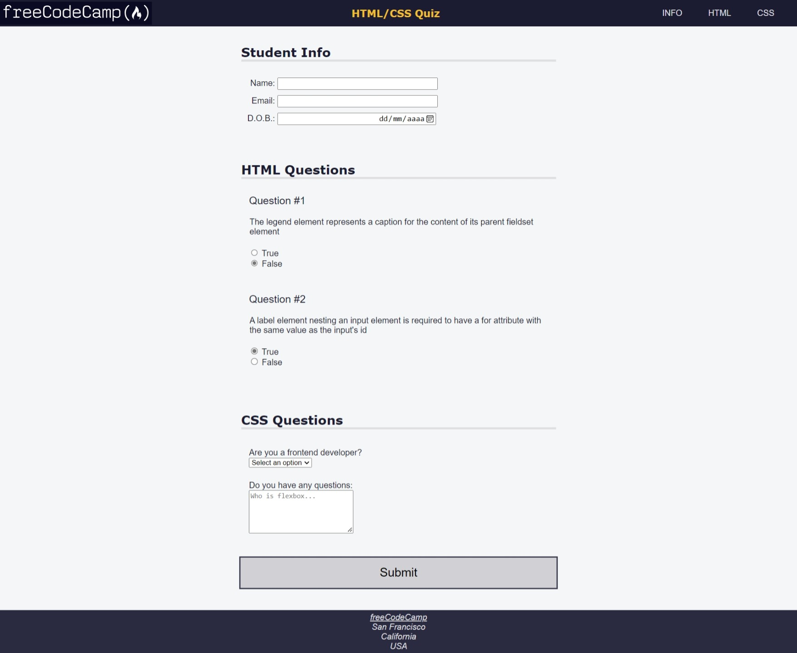

# Aprendendo Acessibilidade criando um Questionário

A acessibilidade facilita a utilização da sua página da web para todos – mesmo para as pessoas com deficiência.

Resultado:


Adicionar o atributo `lang` ao elemento `html` ajuda os leitores de tela a identificar o idioma da página.

O elemento `meta` é usado para especificar informações sobre a página como título, descrição, palavras-chave e autor.

O atributo `charset` especifica a codificação de caracteres da página e, hoje em dia, `UTF-8` é a única codificação suportada pela maioria dos navegadores

Continuando com o `meta`, uma definição de `viewport` informa ao navegador como renderizar a página. Sua inclusão melhora a acessibilidade visual no celular e a **SEO** (otimização de mecanismos de busca).

Outro elemento `meta` importante para acessibilidade e SEO é a `description`. O valor do atributo `content` é usado pelos mecanismos de busca para fornecer uma descrição da página.

O elemento `title` é útil para que leitores de tela entendam o conteúdo de uma página. Além disso, ele é uma parte importante para a `SEO`.

A navegação é uma parte fundamental da acessibilidade. Os leitores de tela dependem do desenvolvedor para fornecer a estrutura da página. E isso é feito com elementos `HTML semânticos`.

`header`: é usado para introduzia a página, e fornecer um menu de navegação.

`main`: contém o conteúdo principal da página.

`footer`: é um container para uma coleção de conteúdos relacionados à página.

`address`: é um container para informações de contato do autor da página.

Uma propriedade útil de um **SVG** (gráficos vetoriais escaláveis) é o atributo `path` (caminho), que permite que a imagem seja dimensionada sem afetar a resolução da imagem resultante.

O elemento `section` serve para separar o conteúdo de um formulário semanticamente.

Para aumentar a acessibilidade da página, o atributo `role` pode ser usado para indicar para tecnologias assistivas a finalidade por trás de um elemento na página. O atributo `role` é parte da *Iniciativa de Acessibilidade da Web (WAI)* e aceita valores pré-definidos.

Cada função `region` requer um rótulo visível, que dever ser referenciado pelo atributo `aria-labelledby`.

O tipo de letra desempenha um papel importante na acessibilidade de uma página. Algumas fontes são mais fáceis de ler do que outras. Isso é especialmente verdadeiro em telas de baixa resolução.

É importante vincular cada `input` ao elemento `label` correspondente. Isso fornece aos usuários de tecnologia assistiva uma referência visual para a entrada. Isso é feito dando ao `label` um atributo `for` que contém o `id` do `input`.

Adicionar um `placeholder` aos elementos `input` não é uma boa prática. Pois, com muita frequência, os usuários confundem o texto do espaço reservado com um valor de entrada real - eles pensam que já existe um valor na entrada. O `label` é a melhor prática.

Quando usarmos abreviações que não sejam muito descritivas, podemos contornar esse problema, sem precisar adicionar texto visível à etiqueta, é adicionar texto que apenas um leitor de tela possa ler. Para isso basta adicionar um elemento `span` com classe `sr-only`.

Para configurar que a etiqueta fique visível apenas para os leitores de tela, existe um padrão comum no CSS:
```CSS
.sr-only {
    position: absolute;
    width: 1px;
    height: 1px;
    padding: 0;
    margin: -1px;
    overflow: hidden;
    clip: rect(0, 0, 0, 0);
    white-space: nowrap;
    border: 0;
}
```

No que se refere à acessibilidade visual, o contraste entre elementos é um fator fundamental. Por exemplo, o contraste entre o texto e o plano de fundo de um título deve ser pelo menos **4,5:1**.


Certos tipos de animações baseadas em movimentos podem causar desconforto para alguns usuários. Em especial, as pessoas com desordens vestibulares têm sensibilidade a certos movimentos.

A regra `@media` tem um recurso de mídia chamado `prefers-reduced-motion` para definir o CSS com base nas preferências do usuário. Ele pode receber um destes valores:
- reduce
- no-preference
```CSS
@media (feature: value){
    selector {
        styles
    }
}
```

A acessibilidade de navegação pode ser melhorada fornecendo atalhos do teclado.

O atributo `acesskey` aceita uma lista de teclas de acesso separadas por espaço. Exemplo:
```HTML
<button type="submit" accesskey="s">Submit</button>
```